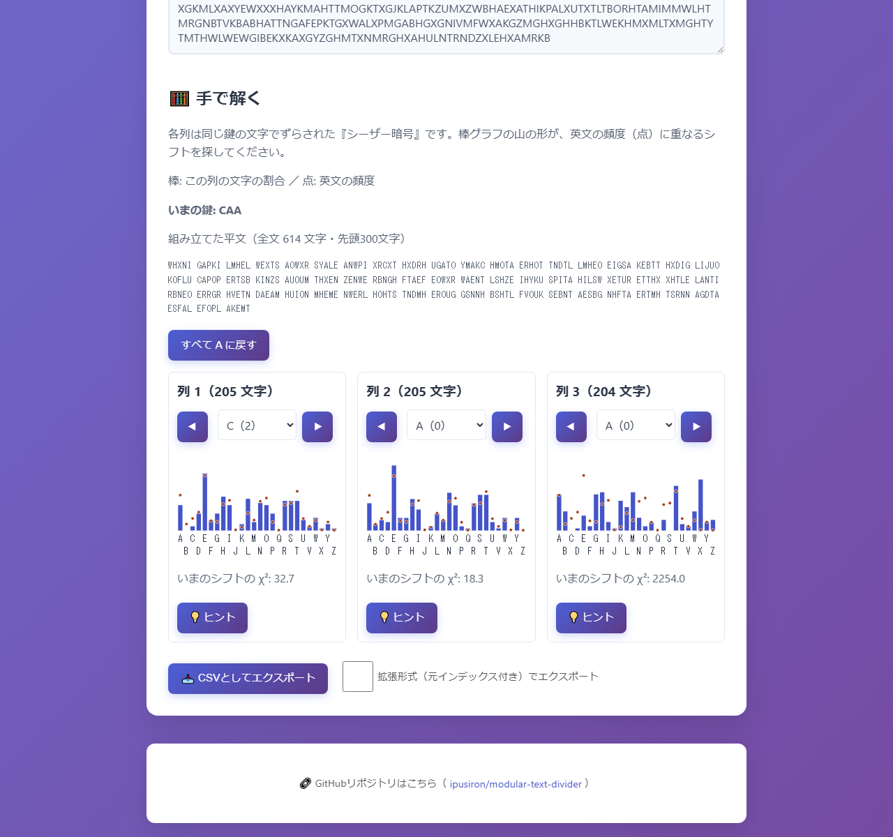
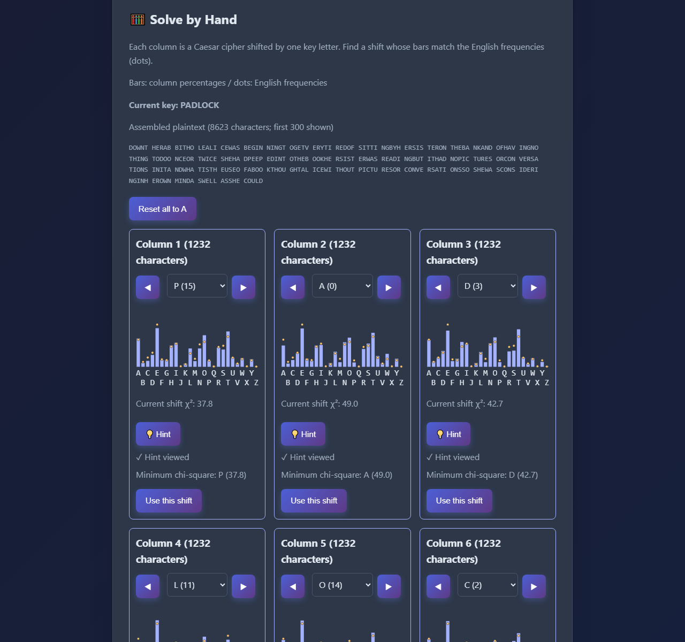

# Modular Text Divider - Periodic Column Divider for Cryptanalysis

日本語: [README.md](README.md)


[](https://ipusiron.github.io/modular-text-divider/)

**Day030 - 100 Security Tools with Generative AI**

**Modular Text Divider** divides text into periodic columns using a specified column count.
It supports the key-length-based splitting step in Vigenère cryptanalysis and sends individual columns to Frequency Analyzer.
Preprocessing, Unicode-aware splitting, CSV export, and URL input run entirely in the browser.

---

## 🌐 Demo

👉 [Open Modular Text Divider](https://ipusiron.github.io/modular-text-divider/)

---

## 📸 Screenshots


*Top of the page after splitting vigenere1 into 3 columns with all preprocessing enabled (light, Japanese, 1280×1200, 192,264 bytes).*


*The same state, showing the 3 columns and CSV export (light, Japanese, 1280×1200, 244,595 bytes).*


*Preprocessed vigenere2 received through the URL and automatically split into 4 columns (dark, English, 1280×1200, 213,787 bytes).*



*vigenere1 with the key set to CAA, showing the assembled plaintext and all 3 graphs (light, Japanese, 1280×1200, 203,953 bytes).*



*vigenere3 after applying hints to all 7 columns: key PADLOCK and plaintext beginning “DOWNT HERAB BITHO…” (dark, English, 1280×1200, 165,345 bytes).*

---

## ✨ Features

### 🔤 Text input

- **Manual input**: Type or paste into the text area
- **File input**: Upload a .txt file
- **Drag and drop**: Drop a text file into the input zone
- **Sample input**: Load a fixed sample with one button
- **Bundled samples**: Choose one of 3 ciphertexts, load it, enable preprocessing, and split at its configured count
- **Live character counts**: Counts for both raw and processed text

### ⚙️ Preprocessing options

- **Uppercase**: Convert letters to uppercase
- **Letters only**: Apply NFKD to fullwidth/accented letters, remove combining marks, and retain A–Z and a–z
- **Remove whitespace**: Remove spaces and other whitespace characters
- **Live preview**: Display preprocessing results immediately

### ✂️ Column splitting

- **Column count**: 1–20, with synchronized slider and number field
- **Validation**: Check invalid counts and empty input
- **Modular assignment**: Character at position i goes to column i mod n
- **Feedback**: Display each column's length and contents

### 📊 Result actions

- **Column output**: Separate read-only text areas
- **📋 Copy**: Copy a column to the clipboard
- **📊 Frequency analysis**: Open the column in an external frequency analyzer in a new tab
- **URL input**: Receive ciphertext and a key length from Day028 using `?text=…&n=…`

### 🧮 Solve by Hand

- **Per-column shifts**: Choose key letters A–Z and compare the bars with dots representing English frequencies
- **Assembled plaintext**: Show the current key and the first 300 plaintext characters grouped in fives
- **Per-column hints**: Reveal the minimum-chi-square shift and apply it with a separate user action
- **Preserved state**: Keep shifts and hints when switching languages; reset all shifts to A when splitting again

### 📥 Export

- **CSV**: RFC 4180 quoting, UTF-8 BOM, and CRLF line endings
- **Standard format**: Characters arranged vertically in each column
- **Extended format**: Include original character indices
- **Timestamped filename**: `split_result_YYYYMMDD_HHMMSS.csv`

### 🎨 Interface

- **🌙 Dark mode**: Switch themes and save the preference
- **❓ Help dialog**: Instructions and tips
- **📱 Responsive layout**: Desktop and mobile
- **🌈 Modern UI**: Card styling and transitions
- **Language switching**: Japanese/English, including help, without clearing input or results
- **🍞 Toasts**: Feedback after actions

---

## 📖 Usage

1. Enter text, choose a text file, or drop one into the input zone. Files must be .txt or text/* and at most 1 MB (1,048,576 bytes).
2. Optionally enable uppercase conversion, letters-only filtering, and whitespace removal.
3. Choose 1–20 columns and select “✂️ Split into columns”.
4. Copy a column or open frequency analysis. Select “📥 Export CSV” to save the result.
5. Editing input, preprocessing, or the column count hides the result. Split again after changes.

Open help with ❓. Tab cycles inside the dialog; Escape closes it and returns focus to the help button.
“🔤 Load sample” inserts the fixed sample. The selector beside it loads one of the bundled samples when you press “Load”.
Loading enables all three preprocessing options, sets the sample's column count (3, 4, or 7), and splits it. This also works under file://.

### 🧮 Solve by Hand

1. Split text whose preprocessed form contains only uppercase A–Z.
2. Use a column's ◀▶ buttons or key-letter selector to change its shift and compare its bars with the English-frequency dots.
3. If needed, select “💡 Hint”, then “Use this shift” to apply the suggestion to that column.
4. Read the current key and assembled plaintext. Select “Reset all to A” to reset the shifts.

There is no button to solve all columns automatically. Use Tab to move, Enter or Space for buttons, and arrow keys for selectors.
Editing the input or column count also discards shifts and hints.

### 📁 Sample data

The repository includes Vigenère ciphertext samples for testing and learning.

| Sample | Key | Key length | Description | Notes |
|---|---|---|---|---|
| vigenere1 | CAT | 3 characters | Basic short-key example | Verify basic column splitting |
| vigenere2 | LOCK | 4 characters | Medium complexity | Verify basic column splitting |
| vigenere3 | PADLOCK | 7 characters | Longer text and key | Plaintext from [Chapter 1 of Alice's Adventures in Wonderland](https://www.gutenberg.org/files/11/11-h/11-h.htm#chap01) |

Each sample contains ciphertext.txt, key.txt, and plaintext.txt.

### Bundled samples

The vigenere2 plaintext.txt previously duplicated the vigenere3 plaintext, so it was replaced with the plaintext recovered from its ciphertext and key.
The corrected file contains 1,146 bytes of the Gettysburg Address (UTF-8, no newline).
SHA-256: `a5a177200b573836654a52d49fac8d76851dbf7993385072e309e1d8a23486e3`.

### Intended uses

- Support cryptanalysis of polyalphabetic ciphers such as Vigenère
- Analyze patterns by column in periodic logs or strings
- Apply frequency analysis to columns treated as individual substitution ciphers
- Examine structural patterns in poems, lyrics, or other text
- Teach cryptography, patterns, and text preprocessing

---

## 🔐 Typical Vigenère Cryptanalysis Workflow

Day028 RepeatSeq Analyzer estimates keys automatically using per-column chi-square scores.
Day030 treats each column as a Caesar cipher shifted by one key letter, letting you match shifts by eye against the frequency profile.

### 1. Estimate the key length with the Kasiski examination

Measure distances between repeated sequences to identify candidate key lengths.
Day028 [RepeatSeq Analyzer](https://ipusiron.github.io/repeatseq-analyzer/) can pass ciphertext and an estimated key length of at most 20 using `?text=…&n=…`.

### 2. 🎯 Split into columns (this tool's role)

Split the ciphertext periodically by the key length and treat each column as an independent monoalphabetic substitution cipher.

### 3. Estimate key letters with frequency analysis

Analyze each column's letter frequencies and use statistical methods to estimate its key letter.

### 4. Decrypt and verify

Try the estimated key and check whether the result is meaningful plaintext.

This tool supports column splitting in step 2 and manual experimentation in steps 3 and 4.
You can also examine individual columns with [Frequency Analyzer](https://ipusiron.github.io/frequency-analyzer/).

---

## 🔬 Specification and Known Answers

Preprocessing runs in this order: **uppercase → letters only → remove whitespace**.
Letters-only mode applies NFKD, removes combining marks, and keeps A–Z and a–z.
For example, uppercase plus letters-only processing converts `ｈｉ Ünï` to `HIUNI`.

Splitting uses Unicode code points. Zero-based position i goes to column i mod n, so surrogate pairs are not split.
This is not grapheme-cluster segmentation: combining sequences and multi-code-point emoji may span columns.
A column count greater than the processed character count is rejected.

CSV follows RFC 4180: cells containing commas, quotes, line breaks, or leading/trailing whitespace are quoted, and embedded quotes are doubled.
Files use a UTF-8 BOM and CRLF line endings. Standard format arranges characters vertically; indexed format uses one row per original character.
Headers are always `Column N` and `Index`. Filenames use `split_result_YYYYMMDD_HHMMSS.csv`.

URL text is limited to 10,000 code points; n must be an integer from 1 to 20.
Receiving text enables all preprocessing. A valid text/n pair splits automatically.
Invalid values are skipped with a message. After loading, text and n are removed from the URL; lang and other parameters remain.

### Known answers

All three preprocessing options are enabled for bundled samples.
Tests recompute this table using DividerCore and the actual sample files.

<!-- known-answers -->
| Input | Columns | First 8 characters of each column | Characters per column |
|---|---|---|---|
| `LXFOPVEFRNHRLXFOPVEFRNHR` | 3 | LOENLOEN XPFHXPFH FVRRFVRR | 8, 8, 8 |
| `vigenere1` | 3 | YPCKJYVQ HIPLEESW XGKMLXAX | 205, 205, 204 |
| `vigenere2` | 4 | QDPDYCZQ CQOSMGCO WQPXGCWV BBNOKQBR | 287, 287, 286, 286 |
| `vigenere3` | 7 | SGDTXDNU OALWNGTS ZEHDQHLL YMLDTECE HWZPBJSH JVKGIGFK ORMQDBYX | 1232, 1232, 1232, 1232, 1232, 1232, 1231 |
<!-- /known-answers -->

### Solving by Hand

With A=0 through Z=25, decrypt a column's ciphertext letter c using shift s as `p = (c - s + 26) mod 26`.
Bars show the column's letter percentages; dots show the same 26 Lewand English-frequency values used by Day009 and Day028.
For column length L and letter frequency f_j (%), the expected count is `E_j = L × f_j / 100`.
Given the original column's counts C, the score is `χ²(s) = Σ(j=0..25) (C[(j+s) mod 26] - E_j)² / E_j`.
Hints choose the lowest score, breaking ties toward the smaller shift. Short columns may not yield the correct key letter.

Reassemble shifted columns by taking position i from `columns[i mod n][floor(i/n)]`.
The display shows the first 300 characters grouped in fives and reports the full character count. CSV still exports the original split result.

<!-- solve-answers -->
| Sample | Columns | Key formed by hint letters | First 40 plaintext characters |
|---|---|---|---|
| `vigenere1` | 3 | CAT | WHENINAPRILTHESWEETSHOWERSFALLANDPIERCET |
| `vigenere2` | 4 | LOCK | FOURSCOREANDSEVENYEARSAGOOURFATHERSBROUG |
| `vigenere3` | 7 | PADLOCK | DOWNTHERABBITHOLEALICEWASBEGINNINGTOGETV |
<!-- /solve-answers -->

Tests recompute this table using DividerCore and the bundled files.

---

## 🔗 Integration with Other Tools

### Sending to Frequency Analyzer

“📊 Open frequency analysis” opens [Frequency Analyzer](https://ipusiron.github.io/frequency-analyzer/) in a new tab.
Links use `rel="noopener noreferrer"`. Columns longer than 5,000 code points display “Analyze the first 5,000 characters”
and send only that prefix. There is no confirmation dialog. You can also copy and paste manually.

### GET parameters

```text
https://ipusiron.github.io/frequency-analyzer/?text=HELLO%20WORLD
https://ipusiron.github.io/modular-text-divider/?text=LXFOPVEFRNHRLXFOPVEFRNHR&n=3
```

Day028 RepeatSeq Analyzer can supply ciphertext and an estimated key length through text and n.
The maximum key length accepted here is 20. Use `?lang=ja` or `?lang=en` to select a language.

**Privacy**: URLs contain the supplied text and may remain in browser history or at a sharing destination.
Replacing the address after loading does not erase shared copies. Do not send sensitive text through URLs.

---

## 🔧 Technical Notes

### Slider labels (the most difficult layout task)

The slider spans 1–20, with labels at 1, 3, 5, 9, and 20.
This was the most difficult layout detail in the original implementation and required repeated testing and fine adjustments.

**Problem**: Manually calculated percentages initially produced misaligned tick marks and labels because of browser differences and native slider rendering.

**Solution**: CSS Grid provides equal spacing, with individual translation adjustments.
The labels and range input now share a .slider-track container instead of relying on a fixed 90px left margin.

#### 1. Equal spacing with CSS Grid

```css
.slider-labels {
  display: grid;
  grid-template-columns: repeat(20, 1fr);
  font-size: 0.85em;
  width: 100%; /* Same container width as the slider */
  text-align: center;
}
```

#### 2. Individual adjustments

Each label is aligned with its tick mark using translateX.

```css
.slider-labels .label-1  { transform: translateX(20%); }
.slider-labels .label-3  { transform: translateX(10%); }
.slider-labels .label-5  { transform: translateX(5%); }
/* label-9 requires no adjustment */
.slider-labels .label-20 { transform: translateX(-25%); }
```

#### 3. HTML structure

```html
<div class="slider-labels">
  <span class="label-1">1</span>        <!-- Cell 1, +20% -->
  <span></span>                       <!-- Empty cell 2 -->
  <span class="mark label-3">3</span>   <!-- Cell 3, +10% -->
  <span></span>                       <!-- Empty cell 4 -->
  <span class="mark label-5">5</span>   <!-- Cell 5, +5% -->
  <!-- Empty cells 6–8 -->
  <span class="mark label-9">9</span>   <!-- Cell 9 -->
  <!-- Empty cells 10–19 -->
  <span class="label-20">20</span>      <!-- Cell 20, -25% -->
</div>
```

Benefits include equal grid spacing, pixel-level adjustment, and more consistent visual alignment across browsers.
The original offsets (20%, 10%, 5%, -25%) were selected through repeated browser checks and 1% adjustments.
This illustrates the iterative testing needed for UI details.

### Dark mode

The theme uses CSS variables and a data attribute.

```css
:root {
  --text-color: #2d3748;
  --card-bg: #ffffff;
}
[data-theme="dark"] {
  --text-color: #e2e8f0;
  --card-bg: #2d3748;
}
```

Changing one data-theme attribute updates the theme. A synchronous script applies the saved theme before first paint.

### Timestamped filenames

CSV filenames include the current local date and time to help organize downloads.

```javascript
const timestamp = now.getFullYear() +
  String(now.getMonth() + 1).padStart(2, '0') +
  String(now.getDate()).padStart(2, '0') + '_' +
  // Hours, minutes, seconds...
const filename = `split_result_${timestamp}.csv`;
```

Example: `split_result_20250730_143025.csv`.

---

## 🔒 Security

Processing stays on the device; the page makes no automatic requests to external hosts.
Frequency-analysis links open only when activated. CSP restricts scripts and styles to the same origin.
There are no inline scripts/styles or external dependencies. The referrer policy is no-referrer.
Input is assigned through textContent or value rather than interpreted as HTML.

Only language (`divider-language`) and theme (`theme`) are stored in localStorage.
The tool works when storage is unavailable. Language priority is URL → saved preference → browser language.
The default theme is light. HTTP-header-only framing restrictions are not configured on GitHub Pages.

CSV preserves input characters. When opening untrusted input in a spreadsheet, avoid allowing it to be evaluated as formulas.

---

## 🧪 Tests

Run `npm test` with Node.js 22. No npm dependencies are required.
GitHub Actions runs the same tests on push and pull_request.

| Test | Coverage |
|---|---|
| core.test.js | Split/solve answers, 3 sample sets, 200 seeded texts × counts 1–20 round trips, shift round trips, CSV parsing |
| samples.test.js | Embedded ciphertext bytes, recovered plaintext, and the corrected plaintext SHA-256 |
| i18n.test.js | Dictionary keys, values, placeholders, used keys, Japanese literals, help integration |
| html.test.js | Core delegation, CSP, referrer, ARIA, safe DOM operations, file limits |
| contrast.test.js | Text contrast ≥4.5:1; focus, bars, and dots ≥3:1 in both themes |
| format.test.js | Maximum line lengths and minimum line counts |
| readme.test.js | Splitting and solving tables, YAML, complete file tree, 14 matching sections, 5 images |

Browser checks cover HTTP and file://, Japanese and English at 1280/768/390/320px,
keyboard operation, blocked storage, first-paint theme, and actual CSV downloads.

---

## 📁 Directory Structure

```text
modular-text-divider/               # Project root
├── .github/                        # GitHub configuration
│   └── workflows/                  # Continuous integration workflows
│       └── test.yml                # Run tests on push and pull_request with Node 22
├── .gitignore                      # Git ignore rules
├── .nojekyll                       # Disable Jekyll processing on Pages
├── CLAUDE.md                       # Development guide and verification rules
├── LICENSE                         # MIT license
├── README.en.md                    # English README with matching sections
├── README.md                       # Japanese usage, specification, and known answers
├── assets/                         # README screenshots
│   ├── screenshot1.png             # Input and settings (vigenere1, 3 columns)
│   ├── screenshot2.png             # Three output columns and CSV export
│   ├── screenshot3.png             # Four columns received via URL (dark, English, vigenere2)
│   ├── screenshot4.png             # Solving in progress (light, Japanese, key CAA)
│   └── screenshot5.png             # Seven hints applied (dark, English, key PADLOCK)
├── index.html                      # Input, results, CSV, help, and CSP
├── js/                             # Classic scripts with file:// support
│   ├── app.js                      # State, UI, files, integration, and help
│   ├── divider-core.js             # Pure preprocessing, splitting, CSV, and URL core
│   ├── i18n.js                     # Japanese/English dictionaries and switching, including help
│   ├── samples.js                  # Three bundled ciphertexts embedded as a classic script
│   └── theme-init.js               # Theme application before first paint
├── package.json                    # Dependency-free npm test command
├── samples/                        # Ciphertext, keys, and plaintext for known-answer tests
│   ├── vigenere1/                  # Sample with key CAT
│   │   ├── ciphertext.txt          # Ciphertext
│   │   ├── key.txt                 # Key
│   │   └── plaintext.txt           # Plaintext
│   ├── vigenere2/                  # Sample with key LOCK
│   │   ├── ciphertext.txt          # Ciphertext
│   │   ├── key.txt                 # Key
│   │   └── plaintext.txt           # Plaintext
│   └── vigenere3/                  # Long sample with key PADLOCK
│       ├── ciphertext.txt          # Ciphertext
│       ├── key.txt                 # Key
│       └── plaintext.txt           # Plaintext
├── style.css                       # Colors, responsive layout, and slider labels
└── test/                           # Automated node --test tests
    ├── contrast.test.js            # Light and dark contrast ratios
    ├── core.test.js                # Known answers, Unicode round trips, and CSV parsing
    ├── format.test.js              # Line lengths and minimum line counts
    ├── html.test.js                # CSP, ARIA, and safe DOM operations
    ├── i18n.test.js                # Dictionary keys, values, and Japanese literal rules
    ├── samples.test.js             # Embedded ciphertexts, corrected plaintext, and SHA-256
    └── readme.test.js              # Tables, YAML, trees, images, and headings
```

---

## 💻 Requirements

A modern browser supporting JavaScript, Unicode property escapes, NFKD, and CSS Grid is required.
No build step is needed. Open index.html directly with file:// or serve it with `python -m http.server 8000`.
Clipboard operations depend on browser permissions. Browser verification uses Chromium.

---

## 📄 License

MIT License. See [LICENSE](LICENSE) for details.

---

## 🛠️ About This Tool

This tool is part of the “100 Security Tools with Generative AI” project.
The project uses AI assistance to create and publish security-related tools over 100 days.

See the project page for details and other tools.

🔗 [100 Security Tools with Generative AI](https://akademeia.info/?page_id=42163)
