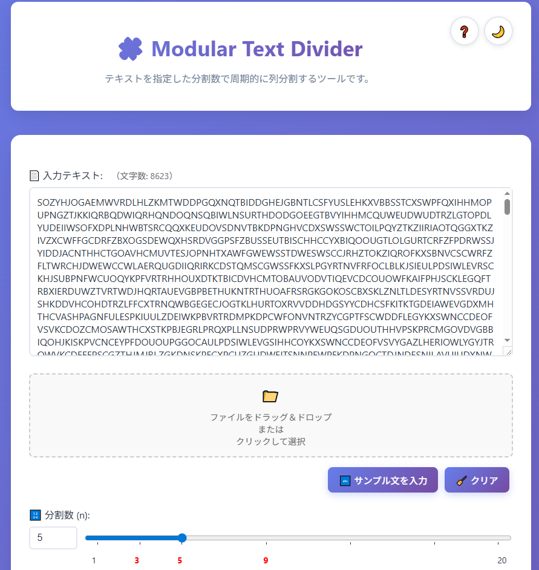
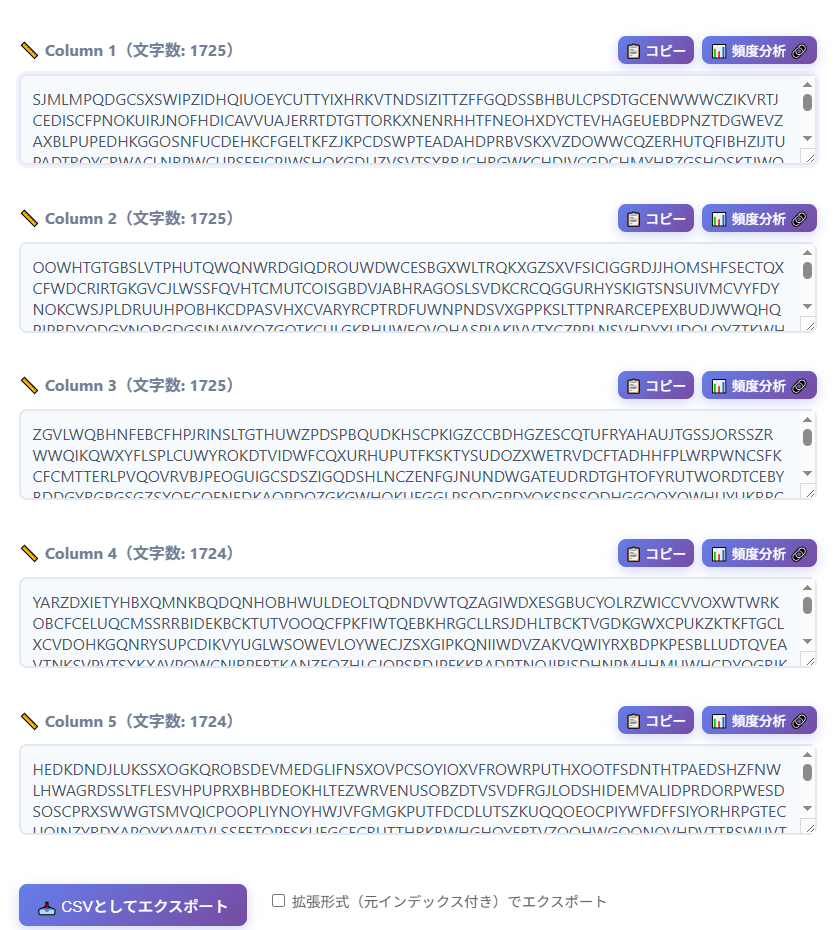

# Modular Text Divider - テキスト列分割ツール


**Day030 - 生成AIで作るセキュリティツール100**

**Modular Text Divider** は、テキストを指定した分割数にしたがって周期的に分割するツールです。

AIを活用して、教育・可視化・ツール化を高速に反復し、暗号やセキュリティの理解を深めることを目的としています。

本ツールは、多表式暗号（ヴィジュネル暗号など）の解読で不可欠な「列分割処理」に焦点を当てます。
また、暗号以外にもテキスト解析やデータ前処理など、汎用性のある構成を意識しています。

列分割処理したテキストは頻度分析ツールとの連携によって、多表式暗号の解読を段階的に支援できる構造になっています。

---

## 🔗 デモページ

👉 [https://ipusiron.github.io/modular-text-divider/](https://ipusiron.github.io/modular-text-divider/)

---

## 📸 スクリーンショット

>
>
>*ヴィジュネル暗号文を指定*
>
>
>
>*5文字区切りで列分割処理した結果*

---

## ✨ 主な機能

### 🔤 テキスト入力
- **手動入力**: テキストエリアへの直接入力
- **ファイル読み込み**: .txtファイルのアップロード対応
- **ドラッグ&ドロップ**: ファイルを直接ドラッグして読み込み
- **サンプル文入力**: ワンクリックでサンプルテキストを挿入
- **リアルタイム文字数表示**: 入力・処理後テキストの文字数を表示

### ⚙️ テキスト処理オプション
- **小文字→大文字変換**: すべての英字を大文字に統一
- **アルファベット以外を除去**: 英字以外の文字（数字、記号、空白など）を削除
- **スペース除去**: 空白文字を削除
- **リアルタイムプレビュー**: 処理結果を即座に確認

### ✂️ 列分割機能
- **分割数設定**: 1～20の範囲で指定（スライダー・数値入力両対応）
- **入力検証**: 無効な分割数や空テキストのエラーチェック
- **モジュラー演算**: `text[i] → column[i % n]`による周期的分割
- **視覚的フィードバック**: 各列の文字数と内容を明確に表示

### 📊 結果表示・操作
- **各列表示**: 分割結果を列ごとに整理して表示
- **📋 コピー機能**: 各列のテキストをワンクリックでクリップボードにコピー
- **📊 頻度分析連携**: 各列のテキストを外部の頻度分析ツールで開く（新しいタブ）
- **🔗 外部ツール連携**: Vigenère Cipher Toolとの自動連携（5,000文字制限）

### 📥 エクスポート機能
- **CSV形式出力**: 分割結果をCSV形式でダウンロード
- **通常形式**: 列ごとの文字を行で整理
- **拡張形式**: 元のインデックス情報付きで出力
- **タイムスタンプ付きファイル名**: `split_result_YYYYMMDD_HHMMSS.csv`形式

### 🎨 ユーザーインターフェイス
- **🌙 ダークモード**: ライト/ダークモード切り替え（設定自動保存）
- **❓ ヘルプモーダル**: 包括的な使用方法とヒントを表示
- **📱 レスポンシブデザイン**: デスクトップ・モバイル両対応
- **🌈 モダンUI**: グラスモーフィズムデザインとスムーズアニメーション
- **🍞 トースト通知**: 操作完了時の視覚的フィードバック

---

## 🔐 ヴィジュネル暗号解読の典型的な流れ

ヴィジュネル暗号の解読は以下の段階的なプロセスで行われます：

### 1. **カシスキー法による鍵長特定**
暗号文中の同じ文字列の出現間隔を測定し、鍵長の候補を絞り込む

### 2. **🎯 列分割（本ツールの役割）**
特定した鍵長で暗号文を周期的に分割し、各列を独立した単一換字暗号として扱う

### 3. **頻度分析による鍵特定**
各列に対して文字頻度分析を実行し、統計的手法で鍵の各文字を推定

### 4. **復号と検証**
推定した鍵で復号を試行し、意味のある平文が得られるかを確認

**本ツールは上記プロセスの「ステップ2」を効率化**し、カシスキー法で得られた鍵長候補を用いて暗号文を適切に列分割します。分割後の各列は[Frequency Analyzer](https://ipusiron.github.io/frequency-analyzer/)などの頻度分析ツールと連携することで、完全な解読ワークフローを実現できます。

---

## 🧠 想定される用途

- ヴィジュネル暗号などの **多表式暗号解読支援**
- 周期性のあるログや文字列の **列ごとのパターン分析**
- 単一換字として扱える列に対して **頻度分析を適用**
- 詩・歌詞・俳句などの **構造的分析**
- **教育用途**（暗号・パターン分析・整形手順の可視化）

---

## 📦 フォルダー構成

```
modular-text-divider/
├── index.html          # メイン画面・UI構造
├── style.css           # モダンUI・ダークモード対応スタイル
├── script.js           # アプリケーションロジック・イベント処理
├── CLAUDE.md           # Claude Code用プロジェクト設定・開発ガイド
├── README.md           # プロジェクト説明書（本ファイル）
├── LICENSE             # MITライセンス
├── assets/             # 画像・リソースファイル
│   └── screenshot.png  # デモ用スクリーンショット
└── samples/            # ヴィジュネル暗号のサンプルセット
    ├── vigenere1/      # サンプル1: CAT鍵
    │   ├── ciphertext.txt
    │   ├── key.txt
    │   └── plaintext.txt
    ├── vigenere2/      # サンプル2
    │   ├── ciphertext.txt
    │   ├── key.txt
    │   └── plaintext.txt
    └── vigenere3/      # サンプル3
        ├── ciphertext.txt
        ├── key.txt
        └── plaintext.txt
```

### 📁 サンプルデータ

テスト・学習用のヴィジュネル暗号サンプルを用意しています：

| サンプル | 鍵 | 鍵長 | 説明 | 備考 |
|---------|-----|-----|-----|--------------|---|
| vigenere1 | CAT | 3文字 | 短い鍵での基本例 |   |
| vigenere2 | LOCK | 4文字 | 中程度の複雑さ |    |
| vigenere3 | PADLOCK | 7文字 | より複雑な長い鍵 | 平文は[[『不思議の国のアリス』（"Alice's Adventures in Wonderland"）の第1章](https://www.gutenberg.org/files/11/11-h/11-h.htm#chap01) |

各サンプルには暗号文（ciphertext.txt）、鍵（key.txt）、平文（plaintext.txt）が含まれています。

---

## 🔗 他ツールとの連携：Frequency Analyzer

各列に対して頻度分析を行いたい場合は、以下のツールと連携できます：

👉 [Vigenère Cipher Tool (Frequency Analyzer)](https://ipusiron.github.io/vigenere-cipher-tool/)

### 連携方法

**1. ワンクリック連携（推奨）**
- 各列の「📊 頻度分析 🔗」ボタンをクリック
- 自動的に新しいタブでFrequency Analyzerが開き、テキストが送信されます
- ボタンホバー時にツールチップで詳細を確認できます

**2. 手動連携**
- 各列の「📋 コピー」ボタンでテキストをコピー
- コピー完了時にトースト通知で確認
- Frequency Analyzerに手動で貼り付け

### GETパラメーター仕様

本ツールは以下の形式でFrequency Analyzerにテキストを送信します：

```
https://ipusiron.github.io/frequency-analyzer/?text={URLエンコードされたテキスト}
```

**制限事項：**
- 文字数制限：5,000文字（GETパラメーターの実用的制限）
    - GETパラメーターが何文字送れるかはブラウザー依存。IEだと2,000文字、Chrome / Firefox / Edgeだと8万文字（理論上はもっと可）とされる。
- 5,000文字を超える場合は確認ダイアログが表示し、OKなら先頭5,000文字だけ送る
- URLエンコードにより日本語や特殊文字も対応
- URLエンコードによって、1文字が3文字にエンコードされるケースもある。

**使用例：**

```
https://ipusiron.github.io/frequency-analyzer/?text=HELLO%20WORLD
```

---

## 🔧 技術的なメモ

### スライダーラベルの実装（🔥 最難関の実装課題）

スライダー（1-20の範囲）の下に表示される数値ラベル（1, 3, 5, 9, 20）の位置合わせについて：

**⚠️ 注意**: この実装は**プロジェクト全体で最も困難で手こずった部分**です。一見シンプルに見えますが、実際には複数回の試行錯誤と微調整が必要でした。

**問題**: 初期実装では手動で各ラベルの位置をパーセンテージで計算していたが、ブラウザー間の差異やスライダーの内部実装により、目盛りと数値ラベルが正確に一致しない問題が発生。数値が目盛りから大幅にずれて表示され、**何度も位置調整を繰り返す**ことになった。

**解決方法**: CSS Grid + 個別微調整による精密な位置合わせ

#### 1. 基本構造: CSS Gridによる均等配置
```css
.slider-labels {
  display: grid;
  grid-template-columns: repeat(20, 1fr);  /* 20等分のグリッド */
  font-size: 0.85em;
  margin-left: 90px;  /* スライダーとの位置合わせ */
  width: calc(100% - 90px);  /* スライダー幅に一致 */
  text-align: center;
}
```

#### 2. 個別ラベルの微調整
各ラベルをスライダーの目盛り棒線に正確に合わせるため、`transform: translateX()`で微調整：

```css
.slider-labels .label-1  { transform: translateX(20%); }
.slider-labels .label-3  { transform: translateX(10%); }
.slider-labels .label-5  { transform: translateX(5%); }
/* label-9は調整不要（既に中央） */
.slider-labels .label-20 { transform: translateX(-25%); }
```

#### 3. HTML構造
```html
<div class="slider-labels">
  <span class="label-1">1</span>        <!-- 1番目 + 20%調整 -->
  <span></span>                         <!-- 2番目（空） -->
  <span class="mark label-3">3</span>   <!-- 3番目 + 10%調整 -->
  <span></span>                         <!-- 4番目（空） -->
  <span class="mark label-5">5</span>   <!-- 5番目 + 5%調整 -->
  <!-- ... 8個の空セル ... -->
  <span class="mark label-9">9</span>   <!-- 9番目（調整不要） -->
  <!-- ... 10個の空セル ... -->
  <span class="label-20">20</span>      <!-- 20番目 - 25%調整 -->
</div>
```

**利点**:
- CSS Gridによる基本的な均等配置
- 個別調整による**ピクセル単位の精密な位置合わせ**
- ブラウザー間の一貫性が保証される
- スライダーの目盛りと数値が**視覚的に完璧に一致**

**🎯 開発のポイント**: この実装は**試行錯誤の結果**であり、最初から完璧にできたわけではありません。各ラベルの`translateX()`値（20%, 10%, 5%, -25%）は、実際にブラウザーで表示確認しながら**1%ずつ微調整**して決定されました。UIの品質にこだわるなら、この種の地道な調整作業が不可欠です。

### ダークモード実装

CSS変数とデータ属性を使用したテーマシステム：

```css
:root {
  --text-color: #2d3748;    /* ライトモード */
  --card-bg: #ffffff;
}

[data-theme="dark"] {
  --text-color: #e2e8f0;    /* ダークモード */
  --card-bg: rgba(45, 55, 72, 0.95);
}
```

**メリット**: 単一の`data-theme`属性変更で全要素のテーマが切り替わる

### ファイル名タイムスタンプ

CSVエクスポート時の重複防止とファイル管理：

```javascript
// YYYYMMDD_HHMMSS形式のタイムスタンプ生成
const timestamp = now.getFullYear() +
  String(now.getMonth() + 1).padStart(2, '0') +
  String(now.getDate()).padStart(2, '0') + '_' +
  // 時分秒...
const filename = `split_result_${timestamp}.csv`;
```

**結果**: `split_result_20250730_143025.csv`のような一意なファイル名

---

## 📄 ライセンス

MIT License - 詳細は[LICENSE](LICENSE)をご覧ください。

---

## 🛠 このツールについて

本ツールは、「生成AIで作るセキュリティツール100」プロジェクトの一環として開発されました。
このプロジェクトでは、AIの支援を活用しながら、セキュリティに関連するさまざまなツールを100日間にわたり制作・公開していく取り組みを行っています。

プロジェクトの詳細や他のツールについては、以下のページをご覧ください。

🔗 [https://akademeia.info/?page_id=42163](https://akademeia.info/?page_id=42163)
