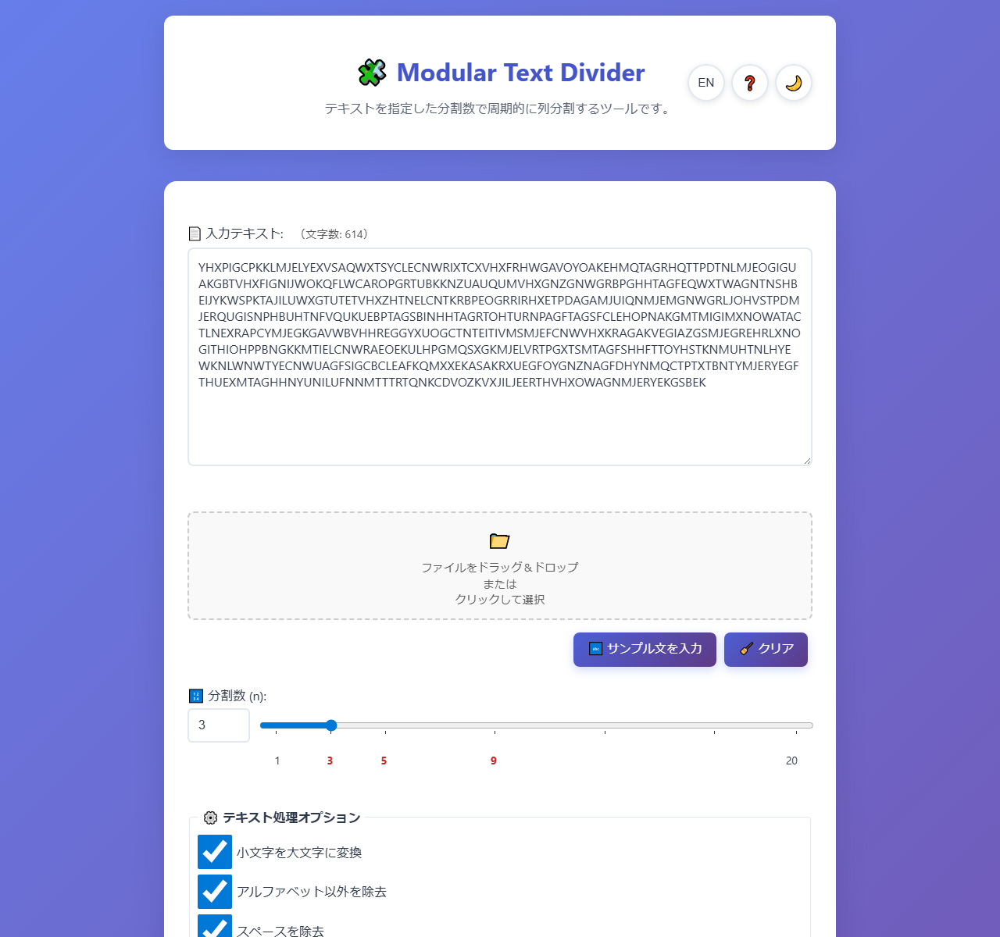
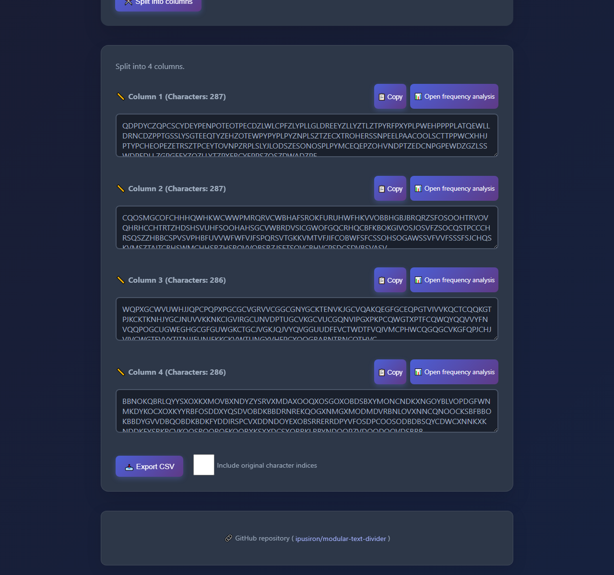

<!--
---
id: day030
slug: modular-text-divider

title: "Modular Text Divider"

subtitle_ja: "テキスト列分割ツール"
subtitle_en: "Periodic Column Divider for Cryptanalysis"

description_ja: "テキストを指定した分割数にしたがって周期的に分割するツール。多表式暗号（ヴィジュネル暗号など）の解読で不可欠な列分割処理を効率化し、頻度分析ツールとの連携で段階的な解読を支援する。"
description_en: "A tool that periodically divides text into columns based on a specified divisor. Streamlines the column division process essential for breaking polyalphabetic ciphers (such as Vigenère cipher), enabling step-by-step cryptanalysis through integration with frequency analysis tools."

category_ja:
  - 暗号解析
  - テキスト処理
category_en:
  - Cryptanalysis
  - Text Processing

difficulty: 1

tags:
  - vigenere
  - cryptanalysis
  - frequency-analysis
  - polyalphabetic-cipher
  - text-division
  - modular-arithmetic

repo_url: "https://github.com/ipusiron/modular-text-divider"
demo_url: "https://ipusiron.github.io/modular-text-divider/"

hub: true
---
-->

# Modular Text Divider - テキスト列分割ツール

English: [README.en.md](README.en.md)


[](https://ipusiron.github.io/modular-text-divider/)

**Day030 - 生成AIで作るセキュリティツール100**

**Modular Text Divider**は、テキストを指定した分割数で周期的に列へ分けるツールです。
ヴィジュネル暗号などの解読で鍵長ごとの列分割を行い、各列をFrequency Analyzerへ渡せます。
前処理・Unicode対応の分割・CSV出力・URLでの受け取りを、ブラウザー内で処理します。

---

## 🌐 デモページ

👉 [https://ipusiron.github.io/modular-text-divider/](https://ipusiron.github.io/modular-text-divider/)

---

## 📸 スクリーンショット



*vigenere1を前処理3種オン・3列で分割した状態のページ先頭（ライト・日本語、1280×1200、192,264バイト）。*


*同じ状態の3列とCSV出力（ライト・日本語、1280×1200、244,595バイト）。*



*前処理したvigenere2をURLで受け取り自動分割した4列（ダーク・英語、1280×1200、213,787バイト）。*

---

## ✨ 機能

### 🔤 テキスト入力
- **手動入力**: テキストエリアへの直接入力
- **ファイル読み込み**: .txtファイルのアップロード対応
- **ドラッグ&ドロップ**: ファイルを直接ドラッグして読み込み
- **サンプル文入力**: ワンクリックでサンプルテキストを挿入
- **リアルタイム文字数表示**: 入力・処理後テキストの文字数を表示

### ⚙️ テキスト処理オプション
- **小文字→大文字変換**: すべての英字を大文字に統一
- **アルファベット以外を除去**: NFKDで全角英字・アクセントを正規化し、A–Z・a–zだけを抽出
- **スペース除去**: 空白文字を削除
- **リアルタイムプレビュー**: 処理結果を即座に確認

### ✂️ 列分割機能
- **分割数設定**: 1～20の範囲で指定（スライダー・数値入力両対応）
- **入力検証**: 無効な分割数や空テキストのエラーチェック
- **モジュラー演算**: `text[i] → column[i % n]`による周期的分割
- **視覚的フィードバック**: 各列の文字数と内容を明確に表示

### 📊 結果表示・操作
- **各列表示**: 分割結果を列ごとに整理して表示
- **📋 コピー機能**: 各列のテキストをワンクリックでクリップボードにコピー
- **📊 頻度分析連携**: 各列のテキストを外部の頻度分析ツールで開く（新しいタブ）
- **URL受け取り**: Day028から`?text=…&n=…`で暗号文と鍵長を受け取り

### 📥 エクスポート機能
- **CSV形式出力**: RFC 4180形式、UTF-8のBOMとCRLFでダウンロード
- **通常形式**: 列ごとの文字を行で整理
- **拡張形式**: 元のインデックス情報付きで出力
- **タイムスタンプ付きファイル名**: `split_result_YYYYMMDD_HHMMSS.csv`形式

### 🎨 ユーザーインターフェイス
- **🌙 ダークモード**: ライト/ダークモード切り替え（設定自動保存）
- **❓ ヘルプモーダル**: 包括的な使用方法とヒントを表示
- **📱 レスポンシブデザイン**: デスクトップ・モバイル両対応
- **🌈 モダンUI**: グラスモーフィズムデザインとスムーズアニメーション
- **日英切り替え**: 入力・結果を保ちながらヘルプを含む表示を切り替え
- **🍞 トースト通知**: 操作完了時の視覚的フィードバック

---

## 📖 使い方

1. テキストを入力するか、テキストファイルを選択・ドロップする。ファイルは.txtまたはtext/*、1 MB（1,048,576バイト）以下が対象。
2. 大文字変換、英字だけの抽出、空白除去を必要に応じて選択する。
3. 分割数を1～20で指定し、「✂️ 列分割する」を押す。
4. 各列をコピーするか、頻度分析のリンクを開く。「📥 CSVとしてエクスポート」で保存する。
5. 入力・前処理・分割数を変えると結果は隠れる。変更後はもう一度分割する。

ヘルプは❓から開きます。Tabでダイアログ内を移動し、Escで閉じると元のボタンに戻ります。
「🔤 サンプル文を入力」は固定文を読み込みます。同梱samples/の選択機能はありません。

### 📁 サンプルデータ


テスト・学習用のヴィジュネル暗号サンプルを用意しています。

| サンプル | 鍵 | 鍵長 | 説明 | 備考 |
|---------|-----|-----|-----|--------------|
| vigenere1 | CAT | 3文字 | 短い鍵での基本例 | 基本の列分割を確認 |
| vigenere2 | LOCK | 4文字 | 中程度の複雑さ | 基本の列分割を確認 |
| vigenere3 | PADLOCK | 7文字 | より複雑な長い鍵 | 平文は[『不思議の国のアリス』（"Alice's Adventures in Wonderland"）の第1章](https://www.gutenberg.org/files/11/11-h/11-h.htm#chap01) |

各サンプルには暗号文（ciphertext.txt）、鍵（key.txt）、平文（plaintext.txt）が含まれています。

### 想定される用途

- ヴィジュネル暗号などの **多表式暗号解読支援**
- 周期性のあるログや文字列の **列ごとのパターン分析**
- 単一換字として扱える列に対して **頻度分析を適用**
- 詩・歌詞・俳句などの **構造的分析**
- **教育用途**（暗号・パターン分析・整形手順の可視化）

---

## 🔐 ヴィジュネル暗号解読の典型的な流れ

ヴィジュネル暗号の解読は以下の段階的なプロセスで行われます。

### 1. **カシスキー法による鍵長特定**
暗号文中の同じ文字列の出現間隔を測定し、鍵長の候補を絞り込む。Day028 [RepeatSeq Analyzer](https://ipusiron.github.io/repeatseq-analyzer/)で推定した鍵長（20以下）と暗号文を`?text=…&n=…`で本ツールへ渡す

### 2. **🎯 列分割（本ツールの役割）**
特定した鍵長で暗号文を周期的に分割し、各列を独立した単一換字暗号として扱う

### 3. **頻度分析による鍵特定**
各列に対して文字頻度分析を実行し、統計的手法で鍵の各文字を推定

### 4. **復号と検証**
推定した鍵で復号を試行し、意味のある平文が得られるかを確認

**本ツールは上記プロセスの「ステップ2」を効率化**し、カシスキー法で得られた鍵長候補を用いて暗号文を適切に列分割します。分割後の各列は[Frequency Analyzer](https://ipusiron.github.io/frequency-analyzer/)などの頻度分析ツールと連携することで、完全な解読ワークフローを実現できます。

---

## 🔬 仕様と既知解答

前処理は「大文字化→英字だけ→空白除去」の順です。「英字だけ」はNFKDで全角英字を半角化し、
結合文字を除いてからA–Z・a–zを残します。たとえば`ｈｉ Ünï`に大文字化と英字だけを適用すると`HIUNI`になります。

分割はコードポイント単位です。0始まりの位置iを列i mod nへ入れるため、絵文字のサロゲートペアは割れません。
書記素クラスタ単位ではないため、結合文字や複数コードポイントの絵文字が別の列に分かれる場合があります。
分割数が処理後の文字数を超える場合は分割しません。

CSVはRFC 4180に従い、カンマ・引用符・改行・前後の空白を含むセルを引用し、引用符を二重化します。
UTF-8のBOMを付け、改行はCRLFです。通常形式は列ごとの縦並び、インデックス付きは元の1文字につき1行です。
見出しは日英共通の`Column N`と`Index`、ファイル名は`split_result_YYYYMMDD_HHMMSS.csv`です。

URLではtextを10,000コードポイントまで、nを1～20の整数として受け取ります。
textがあれば前処理をすべてオンにし、textとnの両方が有効なら自動分割します。
不正な値は読み込まず案内を表示します。読込後はtextとnをURLから取り除き、langなどは保持します。

### 既知解答

同梱サンプルは前処理を3つともオンにしています。この表はDividerCoreと実ファイルを使うテストで照合します。

<!-- known-answers -->
| 入力 | 分割数 | 各列の先頭8文字 | 各列の文字数 |
|---|---|---|---|
| `LXFOPVEFRNHRLXFOPVEFRNHR` | 3 | LOENLOEN XPFHXPFH FVRRFVRR | 8, 8, 8 |
| `vigenere1` | 3 | YPCKJYVQ HIPLEESW XGKMLXAX | 205, 205, 204 |
| `vigenere2` | 4 | QDPDYCZQ CQOSMGCO WQPXGCWV BBNOKQBR | 287, 287, 286, 286 |
| `vigenere3` | 7 | SGDTXDNU OALWNGTS ZEHDQHLL YMLDTECE HWZPBJSH JVKGIGFK ORMQDBYX | 1232, 1232, 1232, 1232, 1232, 1232, 1231 |
<!-- /known-answers -->

---

## 🔗 他ツールとの連携

### Frequency Analyzerへの送信

各列の「📊 頻度分析で開く」は[Frequency Analyzer](https://ipusiron.github.io/frequency-analyzer/)を新しいタブで開きます。
リンクには`rel="noopener noreferrer"`を付けます。5,000文字を超える列は表示を「先頭5,000文字で頻度分析」に変え、
先頭5,000コードポイントだけを送ります。確認ダイアログは表示しません。コピーして手動で貼り付けることもできます。

### GETパラメーター仕様

```text
https://ipusiron.github.io/frequency-analyzer/?text=HELLO%20WORLD
https://ipusiron.github.io/modular-text-divider/?text=LXFOPVEFRNHRLXFOPVEFRNHR&n=3
```

Day028 RepeatSeq Analyzerからは暗号文と推定鍵長をtextとnで受け取れます。
鍵長の上限は20です。`?lang=ja`または`?lang=en`で言語を指定できます。

**注意** URLには本文が含まれ、ブラウザーの履歴や共有先に残る可能性があります。
読込後にURLを置き換えても、共有したURLなどから本文が消えることは保証しません。機密情報をURLで渡さないでください。

---

## 🔧 技術的なメモ

### スライダーラベルの実装（🔥 最難関の実装課題）

スライダー（1～20の範囲）の下に表示される数値ラベル（1, 3, 5, 9, 20）の位置合わせについて。

**⚠️ 注意**: この実装は**プロジェクト全体で最も困難で手こずった部分**です。
一見シンプルに見えますが、実際には複数回の試行錯誤と微調整が必要でした。

**問題**: 初期実装では手動で各ラベルの位置をパーセンテージで計算していたが、ブラウザー間の差異やスライダーの内部実装により、目盛りと数値ラベルが正確に一致しない問題が発生。
数値が目盛りから大幅にずれて表示され、**何度も位置調整を繰り返す**ことになった。

**解決方法**: CSS Grid + 個別微調整による精密な位置合わせ

#### 1. 基本構造: CSS Gridによる均等配置
```css
.slider-labels {
  display: grid;
  grid-template-columns: repeat(20, 1fr);  /* 20等分のグリッド */
  font-size: 0.85em;
  width: 100%;  /* .slider-track内でスライダーと同じ幅 */
  text-align: center;
}
```

#### 2. 個別ラベルの微調整
各ラベルをスライダーの目盛り棒線に正確に合わせるため、`transform: translateX()`で微調整。

```css
.slider-labels .label-1  { transform: translateX(20%); }
.slider-labels .label-3  { transform: translateX(10%); }
.slider-labels .label-5  { transform: translateX(5%); }
/* label-9は調整不要（既に中央） */
.slider-labels .label-20 { transform: translateX(-25%); }
```

#### 3. HTML構造
```html
<div class="slider-labels">
  <span class="label-1">1</span>        <!-- 1番目 + 20%調整 -->
  <span></span>                         <!-- 2番目（空） -->
  <span class="mark label-3">3</span>   <!-- 3番目 + 10%調整 -->
  <span></span>                         <!-- 4番目（空） -->
  <span class="mark label-5">5</span>   <!-- 5番目 + 5%調整 -->
  <!-- ... 8個の空セル ... -->
  <span class="mark label-9">9</span>   <!-- 9番目（調整不要） -->
  <!-- ... 10個の空セル ... -->
  <span class="label-20">20</span>      <!-- 20番目 - 25%調整 -->
</div>
```

**利点**
- CSS Gridによる基本的な均等配置
- 個別調整による**ピクセル単位の精密な位置合わせ**
- ブラウザー間の一貫性が保証される
- スライダーの目盛りと数値が**視覚的に完璧に一致**

**🎯 開発のポイント**: この実装は**試行錯誤の結果**であり、最初から完璧にできたわけではありません。各ラベルの`translateX()`値（20%, 10%, 5%, -25%）は、実際にブラウザーで表示確認しながら**1%ずつ微調整**して決定されました。UIの品質にこだわるなら、この種の地道な調整作業が不可欠です。

### ダークモード実装

CSS変数とデータ属性を使用したテーマシステム。

```css
:root {
  --text-color: #2d3748;    /* ライトモード */
  --card-bg: #ffffff;
}

[data-theme="dark"] {
  --text-color: #e2e8f0;    /* ダークモード */
  --card-bg: #2d3748;
}
```

**メリット**: 単一の`data-theme`属性変更で全要素のテーマが切り替わる

### ファイル名タイムスタンプ

CSVエクスポート時の重複防止とファイル管理。

```javascript
// YYYYMMDD_HHMMSS形式のタイムスタンプ生成
const timestamp = now.getFullYear() +
  String(now.getMonth() + 1).padStart(2, '0') +
  String(now.getDate()).padStart(2, '0') + '_' +
  // 時分秒...
const filename = `split_result_${timestamp}.csv`;
```

**結果**: `split_result_20250730_143025.csv`のような一意なファイル名

---

## 🔒 セキュリティ

処理は端末内で完結し、ページから外部ホストへの自動通信はありません。
頻度分析の外部リンクは押したときだけ開きます。CSPはスクリプトとスタイルを同一オリジンに制限し、
インラインスクリプト・インラインスタイル・外部依存を使いません。referrerはno-referrerです。
入力はtextContentまたはvalueへ設定し、HTMLとして解釈しません。

localStorageに保存するのは言語（`divider-language`）とテーマ（`theme`）だけです。
保存できなくても処理は動作します。言語の優先順位はURL→保存値→ブラウザー言語で、テーマの既定はライトです。
GitHub PagesではHTTPヘッダー専用のフレーム埋め込み制御は設定していません。

CSVは入力文字をそのまま保持します。表計算ソフトで開く際は、信頼できない入力を数式として評価しないよう注意してください。

---

## 🧪 テスト

Node.js 22で`npm test`を実行します。npm依存パッケージはありません。
GitHub Actionsはpushとpull_requestで同じテストを実行します。

| テスト | 内容 |
|---|---|
| core.test.js | 指定の既知解答、同梱サンプル3種、固定シードのUnicode文200本×分割数1～20、CSV読み戻し |
| samples.test.js | 埋め込み暗号文のバイト一致、平文の復号一致、訂正平文のSHA-256 |
| i18n.test.js | 日英のキー・値・埋め込み変数、使用キー、日本語リテラル、ヘルプの連携先 |
| html.test.js | 中核の使用、CSP・referrer・ARIA・安全なDOM操作・ファイル上限 |
| contrast.test.js | 両テーマの文字4.5:1以上、フォーカス3:1以上 |
| format.test.js | 最長行と行数下限による可読性の検査 |
| readme.test.js | 既知解答表、YAML、全ファイルのツリー、14節の対応、画像3枚 |

ブラウザー確認ではHTTPとfile://の両方を使い、1280・768・390・320pxの日英、
キーボード、保存遮断、初回テーマ、CSVの実ダウンロードを確認します。

---

## 📁 ディレクトリー構造

```text
modular-text-divider/               # プロジェクトのルート
├── .github/                        # GitHubの設定
│   └── workflows/                  # 自動テストのワークフロー
│       └── test.yml                # Node 22でpushとpull_requestのテストを実行
├── .gitignore                      # Git管理の除外設定
├── .nojekyll                       # PagesのJekyll処理を無効化
├── CLAUDE.md                       # 開発ガイドと検証規則
├── LICENSE                         # MITライセンス
├── README.en.md                    # 同じ構成の英語版README
├── README.md                       # 日本語の使い方・仕様・既知解答
├── assets/                         # README用のスクリーンショット
│   ├── screenshot1.png             # 入力と分割設定（vigenere1、3列）
│   ├── screenshot2.png             # 分割結果3列とCSV出力
│   └── screenshot3.png             # URL受取後の4列（ダーク・英語、vigenere2）
├── index.html                      # 入力・結果・CSV・ヘルプ・CSP
├── js/                             # classic script（file://対応）
│   ├── app.js                      # 状態・画面・ファイル・連携・ヘルプ
│   ├── divider-core.js             # 前処理・分割・CSV・URLの純粋な中核
│   ├── i18n.js                     # ヘルプを含む日英辞書と言語切り替え
│   ├── samples.js                  # 同梱暗号文3種を埋め込むclassic script
│   └── theme-init.js               # 初回描画前のテーマ適用
├── package.json                    # 依存なしのnpm test定義
├── samples/                        # 既知解答テストで読む暗号文と鍵・平文
│   ├── vigenere1/                  # 鍵CATのサンプル
│   │   ├── ciphertext.txt          # 暗号文
│   │   ├── key.txt                 # 鍵
│   │   └── plaintext.txt           # 平文
│   ├── vigenere2/                  # 鍵LOCKのサンプル
│   │   ├── ciphertext.txt          # 暗号文
│   │   ├── key.txt                 # 鍵
│   │   └── plaintext.txt           # 平文
│   └── vigenere3/                  # 鍵PADLOCKの長文サンプル
│       ├── ciphertext.txt          # 暗号文
│       ├── key.txt                 # 鍵
│       └── plaintext.txt           # 平文
├── style.css                       # 配色・レスポンシブ・スライダー目盛り
└── test/                           # node --testの自動テスト
    ├── contrast.test.js            # ライトとダークの配色の比
    ├── core.test.js                # 既知解答・Unicode往復・CSV読み戻し
    ├── format.test.js              # 最長行・行数によるminifyの検出
    ├── html.test.js                # CSP・ARIA・安全なDOM操作
    ├── i18n.test.js                # 辞書のキー・値・日本語リテラル
    ├── samples.test.js             # 埋め込み暗号文・訂正平文・SHA-256
    └── readme.test.js              # 表・YAML・ツリー・画像・見出し
```

---

## 💻 動作環境

JavaScript、Unicodeプロパティエスケープ、NFKD、CSS Gridを利用できるモダンブラウザーが必要です。
ビルドは不要で、`index.html`をfile://で開くか、`python -m http.server 8000`で配信できます。
コピーはブラウザーのクリップボード権限に依存します。検証にはChromiumを使用しています。

---

## 📄 ライセンス

MIT License - 詳細は[LICENSE](LICENSE)をご覧ください。

---

## 🛠️ このツールについて

本ツールは、「生成AIで作るセキュリティツール100」プロジェクトの一環として開発されました。
このプロジェクトでは、AIの支援を活用しながら、セキュリティに関連するさまざまなツールを100日間にわたり制作・公開していく取り組みを行っています。

プロジェクトの詳細や他のツールについては、以下のページをご覧ください。

🔗 [https://akademeia.info/?page_id=42163](https://akademeia.info/?page_id=42163)
